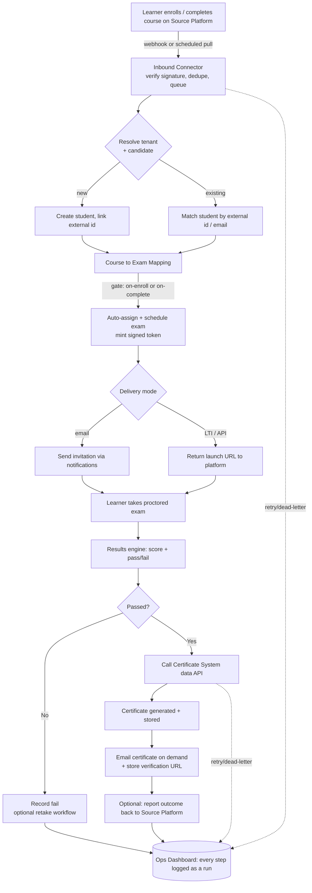

# ProctorGuard V1 — Course-Platform Integration, Exam Automation & Certification

### Product Requirements Document (PRD)

| | |
|---|---|
| **Product** | ProctorGuard (proctor.lsc-crm.in) |
| **Version** | 1.0 — "Integration, Automation & Certification" |
| **Status** | Draft for review |
| **Builds on** | The current ProctorGuard platform (multi-tenant online proctoring, exams, sessions, results, notifications). |
| **Sibling doc** | [ProctorGuard V2 — Physical Classroom & Practical Exam Monitoring](./ProctorGuard_V2_Requirements.md) |
| **Last updated** | 2026-07-16 |
| **Owner** | LSC Solutions |

> **How V1 and V2 relate.** These are two roadmap tracks on the *same* platform, not sequential rewrites.
> **V1 (this doc)** makes ProctorGuard the automated **exam + certification backbone** that other course platforms plug into: a learner enrolls on any connected platform → the right final exam is scheduled automatically (no human in the loop) → the learner is proctored and graded → on pass, an external certificate system is driven via our data API → the certificate is emailed on demand. Every step is watched through a **separate, transparent, human-readable operations dashboard** built on a **customizable, n8n-style workflow engine**.
> **V2** extends the platform to *physical* classroom/practical exams with human assessors.
> Both reuse the same tenancy, roles, exam core, results engine, notifications and audit trail.

---

## 1. Executive Summary

Today ProctorGuard is a self-contained proctoring product: an admin creates exams, adds students, sends invitation links, and reviews results — all by hand, inside one company's console.

**V1 turns ProctorGuard into a platform other systems automate against.** The trigger for an exam is no longer a human clicking "send invitations" — it is an **enrollment event arriving from an external course/LMS platform**. From that single event, ProctorGuard should, with **zero human intervention**:

1. Create or match the learner as a candidate (in the correct tenant/company).
2. Look up which **final exam** that course maps to, and **schedule/assign** it to the learner.
3. Deliver the secure exam link (or expose it back to the origin platform) and run the exam under the existing proctoring engine.
4. Grade the attempt and decide pass/fail using the existing results engine.
5. On **pass**, hand the result to an **external certificate-generation system** via a **data API**, and **email the certificate on demand**.

Three cross-cutting requirements shape the whole design:

- **Many platforms, self-serve.** Onboarding a new course platform must be configuration, not code. The integration layer is generic; each platform is a connector + credential + field-mapping.
- **A separate, transparent operations dashboard.** Ops staff need one screen that shows the entire pipeline in plain language — "Learner X enrolled in Course Y on Platform Z at 10:04, exam scheduled at 10:04, attempted at 14:20, passed 82%, certificate issued & emailed at 14:22" — plus every failure, retry and stuck item.
- **Customizable workflows (n8n-style), production-grade.** The enroll → exam → grade → certify → notify pipeline must be expressible as an editable workflow (triggers → conditions → actions), so each company/course can vary the flow without a code change, while remaining reliable, idempotent, multi-tenant and auditable.

---

## 2. Goals & Non-Goals

### 2.1 Goals
- **G1 — Enrollment-driven exams.** An enrollment on a connected platform automatically results in the correct final exam being assigned/scheduled for that learner, with no manual step.
- **G2 — Any number of platforms.** Add a new source platform through configuration; support many concurrently, each isolated per tenant.
- **G3 — Automated certification.** On pass, generate a certificate through the external certificate system's data API and email it to the learner on demand.
- **G4 — Full transparency.** A dedicated ops dashboard renders the end-to-end journey of every learner and every automation run in human-readable language, including errors and retries.
- **G5 — Customizable workflows.** Non-developers can view and adjust the automation flow (conditions, actions, mappings) per company/course; changes are versioned and auditable.
- **G6 — Production reliability.** Exactly-once effects (idempotent), automatic retries, dead-letter for poison events, reconciliation for missed events, and full audit.

### 2.2 Non-Goals (V1)
- Building a full LMS / course-authoring system inside ProctorGuard. Courses live in the external platforms; ProctorGuard owns exams, proctoring, results and the certification hand-off.
- Being the certificate *renderer*. Certificate design/PDF generation stays in the external certificate system; ProctorGuard supplies the verified data and triggers issuance.
- Replacing the existing admin console. The current console remains; V1 adds the integration layer, the workflow engine and the ops dashboard beside it.
- Real-time (sub-second) sync. Near-real-time (seconds) via webhooks + a reconciliation poll is sufficient.

---

## 3. Market Reference / Benchmarking

V1 combines two well-established product categories — **integration/automation platforms** and **credential-issuance platforms**. What to borrow from each:

| System / Standard | Capability to emulate |
|---|---|
| **n8n / Zapier / Make (workflow automation)** | Visual trigger→condition→action flows, a library of reusable nodes, per-run execution logs, retries, and a "what happened and why" view. n8n specifically is **self-hostable and fair-code**, so it can run inside our infrastructure without sending tenant data to a third party. |
| **LMS webhooks & standards — Moodle, Canvas, Teachable, Thinkific, LearnDash, TalentLMS** | Standard enrollment/completion **webhook** events; where webhooks are absent, **scheduled pull** via the platform's REST API. **LTI 1.3** (Learning Tools Interoperability) as the standards-based way to be launched as an external tool and to return grades via **AGS (Assignment & Grade Services)**. |
| **xAPI / SCORM / Caliper** | Learning-activity statement formats — useful if a platform reports completion as xAPI rather than a webhook. |
| **Accredible, Certifier, Sertifier, Credly / Open Badges** | The certificate-issuance pattern: an upstream system posts verified achievement data to the credential service's API; the service renders, stores, verifies (public verification URL) and emails the credential. This is exactly the "external system generates certificate with our data API" the customer described. |
| **Stripe / GitHub webhooks (engineering pattern, not a competitor)** | The gold standard for **reliable inbound webhooks**: signed payloads, idempotency keys, at-least-once delivery, event IDs, replay, and a delivery dashboard. Our inbound connector should follow this pattern. |

**Positioning:** V1 = "**Zapier-for-exams**" bolted onto a proctoring engine — an integration + automation + certification layer that makes ProctorGuard the exam step inside anyone's learning funnel.

---

## 4. Glossary

| Term | Meaning |
|---|---|
| **Source Platform** | An external course/LMS system that owns courses and enrollments (e.g. a Teachable site). |
| **Connector** | The configured integration to one Source Platform for one tenant: transport (webhook/API/LTI), credentials, and field mappings. |
| **Enrollment Event** | An inbound signal that a learner enrolled in (or completed) a course on a Source Platform. |
| **Course Mapping** | The rule linking a Source Platform's course (by external course id) to a ProctorGuard exam. |
| **Candidate** | A learner represented inside ProctorGuard (the existing `students` entity), possibly linked to an external learner id. |
| **Certificate System** | The external service that renders and stores certificates, driven by ProctorGuard's data API. |
| **Workflow** | A tenant-editable automation: a trigger, ordered steps (conditions/actions), and settings. The n8n-style pipeline definition. |
| **Run / Execution** | One firing of a workflow for one event, with a step-by-step log and a final status. |
| **Ops Dashboard** | The separate, transparent monitoring UI for the whole automation pipeline. |
| **Idempotency Key** | A stable de-duplication key (per event) guaranteeing an event processed twice produces one effect. |

---

## 5. Roles & Permissions

Extends the current role model (`SUPER_ADMIN`, `ADMIN`, `PROCTOR`, `VIEWER`, `STUDENT`). All new capabilities are **company-scoped** (a tenant only sees its own connectors, workflows and runs); `SUPER_ADMIN` sees across tenants.

| Capability | SUPER_ADMIN | ADMIN | INTEGRATION_MANAGER *(new)* | OPS_MONITOR *(new)* | VIEWER | PROCTOR |
|---|---|---|---|---|---|---|
| Create/edit **connectors** (add a platform, credentials) | ✅ all tenants | ✅ own company | ✅ own company | ❌ | ❌ | ❌ |
| Create/edit **course→exam mappings** | ✅ | ✅ | ✅ | ❌ | ❌ | ❌ |
| Create/edit **workflows** | ✅ | ✅ | ✅ (guarded steps gated) | ❌ | ❌ | ❌ |
| View **ops dashboard / runs** | ✅ | ✅ | ✅ | ✅ | ✅ (read-only) | ❌ |
| **Retry / replay** a failed run | ✅ | ✅ | ✅ | ✅ | ❌ | ❌ |
| Manually **re-issue / re-send certificate** | ✅ | ✅ | ✅ | ✅ | ❌ | ❌ |
| Rotate integration **secrets / API keys** | ✅ | ✅ | ✅ | ❌ | ❌ | ❌ |
| View secrets in clear | ❌ (write-only, masked) | ❌ | ❌ | ❌ | ❌ | ❌ |

Two new roles are proposed so integration wiring and day-to-day monitoring can be separated from exam administration; both are optional and can fold into `ADMIN` initially (see §14 Open Questions).

---

## 6. End-to-End Flow

### 6.1 Narrative

1. **Enroll (Source Platform).** A learner buys/enrolls in a course. The platform emits an enrollment webhook (or ProctorGuard polls it).
2. **Ingest (Connector).** ProctorGuard receives the event on a per-tenant, signed webhook endpoint, verifies the signature, records the raw event with an idempotency key, and returns `200` fast (queue-then-process).
3. **Resolve tenant + candidate.** The connector identifies the company, then upserts the learner as a `students` candidate (match by external learner id or email; create if new), linking the external id.
4. **Map course → exam.** Look up the Course Mapping for the event's external course id → target exam. If completion-gated, wait for the "completed" event; if enroll-gated, proceed immediately.
5. **Schedule / assign (no human).** Assign the exam to the candidate (existing `exam_assignments`), mint the signed access token, and either (a) email the invitation via the existing notification path, or (b) return the launch URL to the Source Platform (LTI launch / API response) so the learner starts from within the course.
6. **Proctor + grade (existing engine).** The learner takes the exam under current proctoring; the results engine computes score and pass/fail (auto for objective types, manual queue for free-text).
7. **Decision.** On **result finalized**, the workflow branches on pass/fail.
8. **Certify (external system).** On **pass**, ProctorGuard calls the Certificate System's API with verified data (name, course, exam, score, date, verification id). The certificate is generated and stored there.
9. **Deliver on demand.** The certificate is emailed to the learner — automatically on issue, and/or re-sendable on demand from the ops dashboard or via an API the learner/platform can call.
10. **Report back (optional).** Push the outcome (passed/score/certificate URL) back to the Source Platform via webhook/LTI-AGS so the course marks the learner complete.
11. **Observe.** Every step above is a logged **run** visible on the ops dashboard in plain language, with retries and errors surfaced.

### 6.2 Flow diagram

---

## 7. Feature Modules

Priorities use MoSCoW: **M**ust / **S**hould / **C**ould / **W**on't-yet.

### 7.1 Integration Framework (inbound) — **M**
- Per-tenant, per-connector **signed webhook endpoints** (unique URL + secret).
- **Signature verification**, replay protection, and **idempotency keys** (dedupe on Source Platform event id).
- **Queue-then-process**: accept fast (`200`), process asynchronously via a worker.
- **Scheduled pull** fallback for platforms without webhooks (poll enrollments/completions since a cursor).
- **Connector types shipped first:** Generic REST/Webhook (JSON with a mapping), plus at least one turnkey LMS (recommend Moodle or Teachable), and **LTI 1.3** launch. Others added as configuration/small adapters.
- **Field mapping UI**: map Source Platform fields (email, name, external learner id, external course id, completion status) to ProctorGuard fields.

### 7.2 Course ↔ Exam Mapping — **M**
- A mapping table: (company, source platform, external course id) → target exam, with a **gate** (`ON_ENROLL` vs `ON_COMPLETE`), optional batch, and optional schedule offset (e.g., "exam window opens 7 days after enroll").
- Support **many courses → one exam** and **one course → many exams** (e.g., sequential modules), with ordering.
- Fallback behavior when no mapping exists: hold the event as "unmapped" and surface it on the dashboard for an admin to map (no silent drop).

### 7.3 Enrollment Ingestion & Candidate Provisioning — **M**
- Upsert candidate into existing `students`, matching by external learner id (preferred) or email; store the external linkage.
- Respect existing uniqueness (`students.email`, `students.registration_id`); generate a registration id when the platform doesn't supply one.
- Assign to the mapped batch if provided.
- Never create duplicates on repeated events (idempotent upsert).

### 7.4 Auto-Scheduling Engine — **M**
- On a mapped, gated event: create the assignment (`exam_assignments`), compute the exam window (fixed, or relative to enroll/complete time in the exam's timezone), mint the **signed access token** (reuse the existing `EXAM_ENFORCE_TOKEN` HMAC scheme).
- **Zero human intervention** for the happy path; a human only appears when a workflow explicitly requires approval or when something errors.
- Deliver via the chosen mode (email invite / return launch URL / both).
- Handle re-enrollment and retakes per policy (new attempt vs blocked, reusing existing attempt policy).

### 7.5 Workflow Automation Engine (n8n-style) — **M (core)** / **S (visual editor)**
- A **workflow** = a **trigger** (`enrollment.received`, `enrollment.completed`, `exam.finalized`, `result.passed`, `result.failed`, `certificate.issued`, `manual`), an ordered list of **steps** (conditions + actions), and settings.
- **Action nodes (built-in):** upsert candidate, assign exam, schedule window, send email/SMS (existing notifications), call certificate API, HTTP request (outbound webhook), branch/condition, delay/wait-until, and "report back to platform".
- **Deterministic, versioned, tenant-scoped, auditable.** Each edit is a new version; runs record which version executed.
- **Idempotent steps** with automatic **retry (backoff)** and **dead-letter** on repeated failure.
- **Build vs embed n8n — recommendation:** ship a **native, config-driven workflow model** for the core pipeline (deterministic, multi-tenant, testable, secure — critical because these flows move real candidate data and trigger certificates), and **optionally run self-hosted n8n internally** as the power-user "escape hatch" for bespoke branches, invoked via the outbound HTTP node. This gives the transparency and customizability of n8n without handing multi-tenant certificate-issuing logic to a general-purpose automation runtime on day one. (Confirm in §14.)
- **Human-readable representation:** every workflow and every run renders as plain-language sentences ("When a learner completes *Course X*, assign *Exam Y*, and if they score ≥ 60%, issue a certificate and email it"), not just a node graph — this is the customer's "one human readable language" requirement.

### 7.6 Certificate Pipeline — **M**
- On `result.passed` (respecting each exam's pass rule), call the **Certificate System data API** with a verified payload: learner name, email, course, exam, score/percentage, pass date, unique **verification id**, and tenant/company branding key.
- Store the returned **certificate id + public verification URL + status** against the session/candidate.
- **Email on demand:** auto-email on issue (configurable), and always **re-sendable** — from the ops dashboard, via an API endpoint the learner or Source Platform can call, or as a workflow action. "On demand" = issuance and/or delivery can be triggered later, not only at pass time.
- **Idempotent issuance:** re-running must not mint duplicate certificates (dedupe on verification id / session).
- Handle certificate-system downtime gracefully (retry + dead-letter, visible on dashboard); never silently fail a passed learner's certificate.
- The exact certificate-system API contract is an integration point — the customer will provide it (see §14). Design the connector generically so the contract is configuration.

### 7.7 Notifications — **M (reuse)**
- Reuse existing `notification_templates` / `delivery_logs` / email path for invitations, results and certificate delivery.
- Add templates for: enrollment-received confirmation, exam-scheduled, certificate-issued (with verification link).

### 7.8 Operations Dashboard (separate, transparent) — **M**
- A **dedicated view** (distinct from the exam admin console) showing:
  - **Pipeline overview:** counts by stage (ingested → scheduled → attempted → graded → passed → certified → delivered) with failure counts.
  - **Per-learner journey timeline** in plain language, end-to-end, across platform boundaries.
  - **Run log:** every workflow execution, each step's status, inputs/outputs (redacted for secrets), duration, and error detail.
  - **Actionable failures:** stuck/dead-lettered items with one-click **retry / replay / re-map / re-issue**.
  - **Connector health:** last event received, delivery success rate, signature failures, unmapped-course backlog.
  - **Filters & search** by learner, course, platform, exam, status, date.
- Everything **human-readable**: statuses and errors phrased for ops staff, not stack traces (raw payloads available on drill-down for engineers).

### 7.9 Reliability, Idempotency & Reconciliation — **M**
- Store **every raw inbound event** with its idempotency key and processing status.
- **At-least-once** processing with idempotent effects (exactly-once outcomes).
- **Retry with exponential backoff**; **dead-letter queue** for poison events with alerting.
- **Reconciliation job**: periodically pull recent enrollments/completions from each platform to catch missed webhooks, and periodically re-check pending certificate issuances.
- **Replay**: any stored event can be re-processed safely.

### 7.10 Security & Multi-Tenancy — **M**
- Strict **company scoping** on connectors, mappings, workflows, runs (mirror existing `company_id` scoping and `require_role`/`require_company_id`).
- **Secrets** (platform API keys, webhook signing secrets, certificate-system credentials) stored encrypted, write-only/masked in UI, rotatable.
- Verify inbound signatures; sign outbound requests; TLS everywhere.
- Reuse existing HMAC token scheme for exam links; do not weaken `AUTH_ENFORCE_TOKEN` / `EXAM_ENFORCE_TOKEN`.
- Full **audit log** (reuse `audit_logs`) for connector/mapping/workflow changes and manual retries/re-issues.

### 7.11 Reporting & Analytics — **S**
- Funnel conversion (enrolled → passed → certified), per platform / course / company.
- Time-to-certificate, failure/retry rates, unmapped-course trends.
- Export (CSV) and scheduled summary emails.

---

## 8. Integration API Surface

### 8.1 Inbound (Source Platform → ProctorGuard)
- `POST /api/integrations/{connectorId}/events` — signed webhook receiver (per-tenant secret, idempotency key header). Returns `200` immediately; processing is async.
- **LTI 1.3** launch endpoints (OIDC login + launch) for platforms that launch the exam as an external tool; **AGS** to return grades.
- Scheduled-pull worker per connector (cursor-based).

### 8.2 Outbound (ProctorGuard → external systems)
- **Certificate System:** `issueCertificate(payload)` / `getCertificate(id)` / `resendCertificate(id)` — mapped onto the customer-provided contract.
- **Report-back:** outbound webhook / LTI-AGS to mark completion on the Source Platform.
- **Generic HTTP node** in the workflow engine for any other outbound call.

### 8.3 ProctorGuard data API (consumed by the certificate system) — **M**
- Read-only, authenticated, tenant-scoped endpoints exposing **verified** result data the certificate system pulls or receives: candidate identity, course/exam, score, pass status, date, and a **verification id** the certificate can display and that resolves to a public "is this genuine?" check.

---

## 9. Data Model Additions

New tables (nullable/additive; runtime-migrated via the existing `db_add_column_if_missing()` / `ensure_*_schema()` pattern in `api/_bootstrap.php`, so nothing breaks existing tenants). All carry `company_id`.

| Table | Purpose | Key columns |
|---|---|---|
| `integration_connectors` | One configured Source Platform per tenant. | `id`, `company_id`, `platform_type`, `name`, `transport` (WEBHOOK/PULL/LTI), `credentials_json` (encrypted), `webhook_secret` (encrypted), `field_map_json`, `status`, `created_at`. |
| `integration_events` | Every raw inbound event (audit + idempotency + replay). | `id`, `company_id`, `connector_id`, `external_event_id` (unique per connector = idempotency key), `type`, `payload_json`, `status` (RECEIVED/PROCESSED/FAILED/DEAD/UNMAPPED), `received_at`, `processed_at`, `error`. |
| `course_exam_mappings` | Course → exam rules. | `id`, `company_id`, `connector_id`, `external_course_id`, `exam_id`, `gate` (ON_ENROLL/ON_COMPLETE), `batch_id` (nullable), `schedule_offset_json`, `active`. |
| `candidate_external_links` | Ties a `students` row to external learner ids. | `student_id`, `connector_id`, `external_learner_id`, `external_email`, `linked_at` (unique per connector+learner). |
| `workflows` | Tenant automation definitions (versioned). | `id`, `company_id`, `name`, `trigger`, `definition_json`, `version`, `active`, `updated_at`. |
| `workflow_runs` | One execution per event. | `id`, `company_id`, `workflow_id`, `workflow_version`, `event_id`, `status`, `started_at`, `finished_at`, `summary` (human-readable). |
| `workflow_run_steps` | Per-step log within a run. | `run_id`, `step_index`, `node_type`, `status`, `input_json`, `output_json` (redacted), `error`, `duration_ms`. |
| `certificate_issuances` | Certificate hand-off + delivery tracking. | `id`, `company_id`, `session_id`, `student_id`, `exam_id`, `verification_id` (unique), `external_certificate_id`, `verification_url`, `status` (PENDING/ISSUED/FAILED), `issued_at`, `last_emailed_at`, `email_count`. |

Reused as-is: `students`, `exams`, `exam_assignments`, `exam_batch_assignments`, `exam_sessions`, `session_answers`, results columns (`total_score`/`max_score`/`passed`), `notification_templates`, `delivery_logs`, `audit_logs`, `batches`.

---

## 10. Reuse of the Existing Platform (don't rebuild)

| Need | Existing capability to reuse |
|---|---|
| Tenant isolation | `company_id` scoping + `require_company_id()` / `X-Company-Id` / super-admin company switch. |
| Auth & roles | HMAC session tokens (`AUTH_ENFORCE_TOKEN`), `require_role()`, `require_staff()`. New roles slot into the existing enum. |
| Candidate model | `students` (+ `batches`, `exam_batch_assignments`). |
| Exam scheduling & links | `exams`, `exam_assignments`, signed exam tokens (`EXAM_ENFORCE_TOKEN`), `exam_invitations`. |
| Proctoring & attempts | Existing session/proctoring/violations pipeline — unchanged. |
| Grading & pass/fail | Results engine (`api/results.php`, `grade_question()`), `passed`/`total_score`/`max_score`, manual-grade queue for free-text. |
| Delivery | `notify.php` + `notification_templates` + `delivery_logs`. |
| Audit | `audit_logs`. |
| Safe rollout | Feature flags + runtime `db_add_column_if_missing()` migrations; new endpoints additive so distributed exam links and live tenants are untouched. |

---

## 11. Non-Functional Requirements

- **Reliability:** at-least-once ingestion, idempotent effects, retries with backoff, dead-letter + alerting, reconciliation. No passed learner ever silently misses a certificate.
- **Latency:** enroll → exam-scheduled within seconds of a webhook; reconciliation closes any webhook gaps within the poll interval.
- **Transparency:** 100% of pipeline steps observable on the ops dashboard, in plain language, with drill-down to raw payloads for engineers.
- **Security:** encrypted secrets, signed inbound/outbound, tenant isolation, least-privilege roles, full audit.
- **Scale:** many connectors and workflows per tenant; queue-based processing scales with a worker.
- **Backward compatibility:** additive schema + endpoints; existing console, exam links and tenants unaffected; feature-flagged for safe rollback.
- **Configurability:** new platform onboarding and workflow changes are configuration, not deployments.

---

## 12. Assumptions

- Source Platforms can emit enrollment/completion webhooks **or** expose a pollable enrollment API (at least one).
- The external certificate system exposes an API to issue/fetch/resend certificates; **the customer will provide its contract and credentials.**
- One ProctorGuard exam can serve as the "final exam" for a course; mapping is by external course id.
- Learner email is a reliable match/identity key when an external learner id is absent.
- Self-hosting n8n internally (if adopted as the escape hatch) is acceptable operationally.

---

## 13. Suggested Phasing

| Phase | Deliverable |
|---|---|
| **P1 — Ingest & schedule** | Generic webhook connector, idempotent event store, candidate upsert, course→exam mapping, auto-assign + signed-link delivery. Minimal run log. |
| **P2 — Certify** | Certificate-system connector (customer contract), issuance tracking, on-demand email + resend, verification id/URL. |
| **P3 — Ops dashboard** | Full transparent pipeline view, per-learner journey, run logs, retry/replay/re-issue, connector health, unmapped backlog. |
| **P4 — Workflow engine** | Native config-driven workflows (triggers/conditions/actions), versioning, human-readable rendering, editor; optional self-hosted n8n escape hatch. |
| **P5 — Standards & scale** | LTI 1.3 launch + AGS grade return, more turnkey LMS connectors, reconciliation hardening, analytics/reporting. |

---

## 14. Open Questions (need customer input)

1. **Certificate system contract** — exact API (endpoints, auth, payload/field names, resend semantics, verification URL format)? This unblocks §7.6/§8.
2. **"On demand" delivery** — auto-email on issue, learner-initiated, platform-initiated, or all three? Who can trigger a resend?
3. **First Source Platforms** — which specific platforms (Moodle? Teachable? a custom in-house LMS?) so we pick the first turnkey connectors and confirm webhook vs pull vs LTI.
4. **Gate** — is the exam scheduled on **enroll** or on **course completion**? Per-course configurable, or one global rule?
5. **Exam window** — fixed date/time, or relative to enroll/complete (e.g., "open for 7 days")? Retake policy on fail?
6. **Workflow engine** — accept the recommended **native engine + optional internal n8n** split, or do you specifically want n8n itself as the primary editor tenants use?
7. **New roles** — introduce `INTEGRATION_MANAGER` / `OPS_MONITOR`, or keep everything under `ADMIN` for now?
8. **Report-back** — should ProctorGuard push pass/score/certificate back to the Source Platform (LTI-AGS/webhook), or is the flow one-directional?
9. **Identity matching** — external learner id guaranteed, or must we match on email? How to handle a learner enrolled on two platforms with different emails?
10. **Certificate re-issue on regrade** — if a manual regrade flips fail→pass (or pass→fail), should a certificate be auto-issued / revoked?

---

*Prepared to pair with the V2 (physical/onsite) PRD. Once the customer confirms §14 (especially the certificate-system contract and the first Source Platforms), §8–§9 (API surface & data model) will be finalized against those concrete contracts.*
