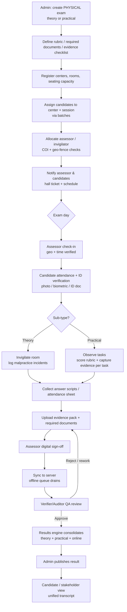

# ProctorGuard V2 — Physical Classroom & Practical Exam Monitoring
### Product Requirements Document (PRD)

| | |
|---|---|
| **Product** | ProctorGuard (proctor.lsc-crm.in) |
| **Version** | 2.0 — "Onsite / Physical Assessment" |
| **Status** | Draft for review |
| **Builds on** | The current ProctorGuard platform (online AI remote proctoring). |
| **Sibling doc** | [ProctorGuard V1 — Course-Platform Integration, Exam Automation & Certification](./ProctorGuard_V1_Requirements.md) — V1 and V2 are two roadmap tracks on the same platform, not sequential rewrites. |
| **Last updated** | 2026-07-16 |
| **Owner** | LSC Solutions |

---

## 1. Executive Summary

V1 of ProctorGuard proctors **remote, online** exams: a candidate sits alone at a webcam, an AI engine watches for malpractice, and everything (video, violations, results) is captured automatically by software.

**V2 extends the same platform to exams that happen in a physical room** — a classroom theory exam or a hands-on practical exam — where the "sensor" is not (only) a camera and an AI, but a **human assessor / invigilator** who is physically present, monitors candidates so no malpractice occurs, verifies identity, marks attendance, evaluates practical work, and **uploads the evidence, attendance and required documents** back into the platform.

V2 unifies both modes under one system, one candidate record, one results engine, and one audit trail — so an organisation can run **online, onsite-theory, and onsite-practical** exams from a single console and get one consolidated, tamper-evident record per candidate.

This model mirrors how established onsite-assessment platforms operate (see §3).

---

## 2. Scope

### 2.1 In Scope (V2)
- A new **exam delivery mode**: `PHYSICAL` (in addition to V1's `ONLINE`), with two sub-types: **Theory** and **Practical**.
- New human roles: **Assessor**, **Invigilator**, **Center Coordinator**, **Verifier/Auditor** (see §5).
- **Exam Center** and **Room/Seating** entities.
- **Assessor allocation** to centers/batches, with conflict-of-interest and geo/time controls.
- **Candidate check-in**: attendance + identity verification (photo/biometric/ID document).
- **Evidence capture & upload**: photos, videos, scanned documents, audio — geo-tagged, timestamped, tamper-evident, with a chain of custody.
- **Physical malpractice / incident logging** by the invigilator/assessor.
- **Practical exam assessment**: rubric/checklist-based scoring, evidence attached per task/observation.
- **Required-documents checklist** per exam (attendance sheet, answer scripts, consent, hall ticket, etc.).
- **Offline-first assessor mobile experience** with background sync (centers often have poor connectivity).
- **Verification / QA workflow**: an auditor reviews uploaded evidence and approves/rejects/flags.
- **Reporting**: center-wise, assessor-wise, malpractice trends, evidence completeness.
- **Reuse of V1** infrastructure: multi-tenant company scoping, authentication & roles, results/grading engine, notifications, audit logs, batches.

### 2.2 Out of Scope (V2)
- Replacing V1 online proctoring (V1 remains as-is; V2 sits beside it).
- Automated CCTV analytics / room-level computer vision (noted as a **future** integration hook in §11, not a V2 deliverable).
- Payroll / travel-expense management for assessors (integration hook only).
- Hardware procurement (biometric devices, kiosks) — V2 supports them via standard APIs but does not ship hardware.

---

## 3. Market Reference / Benchmarking

V2 should behave like the onsite-assessment products already in market. Key references and what to borrow:

| System / Model | Relevant capability to emulate |
|---|---|
| **Mercer \| Mettl (onsite / offline proctoring)** | Assessor-led invigilation, incident capture, unified online+offline candidate record. |
| **TCS iON** (center-based exams) | Exam-center & seat allocation, invigilator app, biometric attendance, secure result consolidation. |
| **NSDC / Sector Skill Council (SSC) assessor model** | The core template for V2: an **external assessor** visits the center, verifies candidates, captures **geo-tagged + timestamped photos/videos** of candidates performing practical tasks, fills marks against a rubric, uploads attendance sheets & documents, and digitally signs off. QA team audits the evidence pack. |
| **OSCE / practical clinical exams** | Station-based / task-based rubric scoring by an examiner; multiple observations per candidate. |
| **ExamSoft / Examplify** | Secure answer capture and document integrity. |
| **Digitally-signed evidence / chain-of-custody (forensic pattern)** | Tamper-evident evidence with hashing, device metadata, immutable audit trail. |

**Design principle borrowed from these systems:** the assessor's phone/tablet is the primary field device; evidence is captured *in-app* (not uploaded from gallery, to prevent staged/old photos), auto-tagged with GPS + time + device, and everything syncs to a central console where a separate QA role verifies before results publish.

---

## 4. Glossary

| Term | Meaning |
|---|---|
| **Delivery mode** | `ONLINE` (V1) or `PHYSICAL` (V2). |
| **Exam sub-type** | `THEORY` or `PRACTICAL` (physical only). |
| **Center** | A physical venue where an exam is held. |
| **Room / Hall** | A space within a center; has a capacity and optional seating plan. |
| **Session (physical)** | A scheduled sitting of an exam at a center/room on a date/time slot. Extends V1's `exam_sessions`. |
| **Assessor** | Person who conducts/evaluates a practical exam and uploads evidence, marks, and documents. |
| **Invigilator** | Person who monitors a (theory) room for malpractice and logs incidents/attendance. (One person may hold both roles.) |
| **Center Coordinator** | On-ground manager of a center; owns logistics, document collection, hand-over. |
| **Verifier / Auditor** | Back-office QA who reviews evidence packs and approves/rejects. |
| **Evidence** | Any captured artefact: photo, video, audio, scanned document, signature. |
| **Evidence pack** | The complete set of required evidence + documents for a session/candidate. |
| **Rubric** | Structured scoring scheme for practical exams (criteria → sub-tasks → marks). |
| **Chain of custody** | The tamper-evident audit trail proving who captured/edited/approved each piece of evidence. |

---

## 5. Roles & Permissions

V2 adds roles to V1's set (`SUPER_ADMIN`, `ADMIN`, `PROCTOR`, `VIEWER`, `STUDENT`). All roles remain **company-scoped** (multi-tenant) exactly as V1.

| Capability | Super Admin | Admin | Center Coordinator | Assessor | Invigilator | Verifier/Auditor | Viewer |
|---|:--:|:--:|:--:|:--:|:--:|:--:|:--:|
| Manage centers, rooms, seating | ✅ | ✅ | ✅ own center | — | — | — | 👁 |
| Schedule physical sessions | ✅ | ✅ | ✅ | — | — | — | 👁 |
| Allocate assessors/invigilators | ✅ | ✅ | ✅ (own center) | — | — | — | — |
| Check-in candidates / attendance | ✅ | ✅ | ✅ | ✅ | ✅ | — | — |
| Verify candidate identity | — | — | ✅ | ✅ | ✅ | — | — |
| Capture & upload evidence | — | — | ✅ | ✅ | ✅ | — | — |
| Log malpractice incident | — | — | ✅ | ✅ | ✅ | — | — |
| Score practical rubric | — | — | — | ✅ | — | — | — |
| Upload required documents | — | — | ✅ | ✅ | ✅ | — | — |
| Digitally sign-off session | — | — | ✅ | ✅ | — | — | — |
| Review / approve / reject evidence | ✅ | ✅ | — | — | — | ✅ | — |
| Publish results | ✅ | ✅ | — | — | — | — | — |
| View reports/dashboards | ✅ | ✅ | own center | own allocations | own allocations | ✅ | 👁 read-only |

*✅ = full · 👁 = read-only · — = none. Exact matrix to be finalised in build; conflict-of-interest rule: an assessor must not be allocated to a batch containing candidates they trained (flag + block).*

---

## 6. End-to-End Flow

The V2 lifecycle, from setup to published result:



### 6.1 Flow stages in detail

**Stage 1 — Exam design (Admin).** Create an exam with `deliveryMode = PHYSICAL`, choose `THEORY` or `PRACTICAL`. For practical, attach a **rubric**. For any physical exam, define the **evidence checklist** (e.g. "candidate photo at seat", "wide room shot", "practical output photo ×3", "video of task 2") and the **required-documents checklist** (attendance sheet, signed consent, scanned answer script, hall ticket, ID proof).

**Stage 2 — Center & scheduling (Admin / Coordinator).** Register centers (address, geo-coordinates, rooms, capacity, seating plan). Create sessions (date, slot, room). Assign candidates to a session (reuse V1 **batches**).

**Stage 3 — Allocation (Coordinator).** Assign assessor(s) and invigilator(s) to each session. Enforce **conflict-of-interest** (assessor ≠ trainer of those candidates) and optional **geo-fencing** (assessor must check in within N metres of the center). Notify all parties.

**Stage 4 — Exam-day check-in (Assessor/Invigilator).** Assessor opens the mobile app, checks in (captures a selfie + GPS + timestamp). App downloads the candidate roster for offline use.

**Stage 5 — Candidate attendance & identity (Assessor/Invigilator).** For each candidate: mark present/absent, capture live photo at seat, verify identity against enrolled photo/ID (manual confirm, or face-match reusing V1's face pipeline). Optional biometric (fingerprint) if a device is available.

**Stage 6a — Theory invigilation.** Invigilator monitors the room. On any malpractice, log an **incident** (candidate, type, severity, description, in-app photo/video evidence, timestamp, GPS). Incidents mirror V1 **violations** so both modes share one anti-malpractice ledger.

**Stage 6b — Practical assessment.** Assessor evaluates each candidate against the **rubric**, task by task, capturing evidence per task (photo/video of the work). Marks entered per criterion; system computes totals (reuse V1 grading/results engine).

**Stage 7 — Document collection & upload.** Collect physical artefacts (answer scripts, signed attendance sheet). Scan/photograph and upload against the **required-documents checklist**. The app shows a completeness meter — the session cannot be signed off until mandatory items are present (or an explicit exception is recorded).

**Stage 8 — Sign-off.** Assessor (and coordinator) digitally sign off the session — a declaration that the assessment was conducted fairly. Signature + identity + time captured.

**Stage 9 — Sync.** Everything queued offline uploads to the server when connectivity returns; each item carries its capture metadata so server-side time is not trusted over capture time.

**Stage 10 — QA / verification.** A **Verifier/Auditor** reviews the evidence pack: are photos genuine (in-app, geo/time consistent), is the document set complete, are marks defensible? Approve, or send back for rework, or flag for investigation.

**Stage 11 — Consolidation & publish.** Once approved, the **results engine** consolidates practical + theory + any online components into one candidate result. Admin publishes; candidate/stakeholder sees a unified transcript.

---

## 7. Feature Modules (with MoSCoW priority)

> **M** = Must-have (V2 core) · **S** = Should-have · **C** = Could-have · **W** = Won't (this version)

### 7.1 Center & Seating Management
- **M** CRUD centers with geo-coordinates, capacity, rooms.
- **M** Assign candidates → center → room → session.
- **S** Visual seating plan / seat numbering; auto-allocate seats.
- **C** QR code per seat for fast candidate check-in.

### 7.2 Scheduling & Allocation
- **M** Physical session scheduling (date, slot, room), reusing V1 timezones.
- **M** Assessor/invigilator allocation with **conflict-of-interest** block.
- **S** **Geo-fenced** assessor check-in (must be near the center).
- **S** Assessor availability calendar; double-booking prevention.
- **C** Auto-suggest nearest available assessor.

### 7.3 Attendance & Identity
- **M** Mark present/absent/late per candidate.
- **M** Live in-app candidate photo at check-in (no gallery uploads).
- **S** Face match against enrolled photo (reuse V1 face pipeline) with a confidence score.
- **S** ID-document capture (Aadhaar/roll number/hall ticket) with OCR of the number.
- **C** Biometric (fingerprint) attendance via external device SDK.
- **M** Digital attendance sheet auto-generated from check-ins; also allow scan of a signed paper sheet.

### 7.4 Evidence Capture & Management
- **M** In-app camera capture (photo/video/audio) — **disable gallery import** for mandatory items to prevent staged evidence.
- **M** Auto-metadata on every artefact: GPS, capture timestamp (device + server), device fingerprint, assessor id, session/candidate id, checklist item.
- **M** Per-exam **evidence checklist**; completeness enforced before sign-off.
- **M** Tamper-evidence: hash each file at capture; store hash in the immutable audit log; detect post-capture edits.
- **S** Automatic image compression + thumbnailing (as V1's live wall already does for frames).
- **S** Watermark evidence with candidate id + timestamp overlay.
- **C** On-device blur of bystanders' faces for privacy.

### 7.5 Anti-Malpractice / Incident (Physical)
- **M** Log incident: candidate, type (copying, phone, impersonation, unfair means, disturbance, etc.), severity, note, in-app evidence.
- **M** Shared ledger with V1 **violations** so one candidate has one malpractice history across modes.
- **S** Incident severity → auto-action (warn / terminate / report) mirroring V1's violation thresholds.
- **S** Bulk/room-level incident (e.g. mass malpractice → cancel room).
- **C** CCTV/room-camera live tile (reuse V1 live-wall UI) if a room camera is available — see §11.

### 7.6 Practical Assessment (Rubric)
- **M** Rubric builder: criteria → sub-tasks → max marks; weightings; pass thresholds.
- **M** Assessor scoring UI (mobile-friendly), evidence attachable per criterion.
- **M** Auto-total + pass/fail via V1 results engine; support manual/observed marks (like V1 free-text grading).
- **S** Rubric templates reusable across exams/batches.
- **C** Multiple assessors per candidate with score reconciliation (moderation).

### 7.7 Required-Documents Management
- **M** Per-exam configurable document checklist (mandatory/optional).
- **M** Upload/scan against each item; completeness meter; block sign-off if incomplete.
- **S** Document type validation (file type, min resolution, page count).
- **S** e-Sign / digital signature capture on declarations.
- **C** OCR extraction + auto-validation (e.g. roll number matches candidate).

### 7.8 Offline-First & Sync
- **M** Full assessor flow works offline: roster, check-in, attendance, evidence, scoring queued locally.
- **M** Background sync with retry/backoff; conflict resolution; visible sync status per item.
- **M** Capture-time metadata trusted over upload-time (poor connectivity is normal).
- **S** Partial/resumable uploads for large videos.
- **S** Storage guardrails on device (auto-purge synced media).

### 7.9 Verification / QA Workflow
- **M** Verifier queue of submitted evidence packs.
- **M** Approve / reject-with-reason / send-for-rework / flag-for-investigation.
- **M** Cross-checks surfaced automatically: GPS vs center, capture-time vs session slot, face-match confidence, gallery-vs-camera origin, duplicate/hash-collision detection.
- **S** Sampling mode (QA a % of packs) with risk-based prioritisation.
- **C** Second-level audit / appeals.

### 7.10 Results & Publishing
- **M** Consolidate theory + practical + online components → one candidate result.
- **M** Reuse V1 results/pass-fail and transcript rendering.
- **S** Withhold result until QA-approved; block publish on open incidents.
- **S** Certificate generation on pass.

### 7.11 Notifications
- **M** Assessor allocation, schedule, and check-in reminders (reuse V1 email/notify).
- **S** SMS/WhatsApp/push for field staff (often no email on phones).
- **S** Candidate hall-ticket + venue notifications.

### 7.12 Reporting & Dashboards
- **M** Center-wise, assessor-wise, batch-wise completion & attendance.
- **M** Malpractice trends (by type/center/assessor).
- **S** Evidence-completeness and QA turnaround dashboards.
- **S** Assessor performance & reliability (rejection rate, COI flags).
- **C** Geospatial map of centers/sessions in progress.

---

## 8. Evidence & Chain of Custody (detail)

Every artefact carries a metadata envelope, captured at the moment of capture and made immutable:

```
Evidence {
  id, companyId, sessionId, candidateId, checklistItemId,
  type: photo | video | audio | document | signature,
  fileHash (SHA-256 at capture),
  capturedBy (assessorId), capturedAtDevice (ts), capturedAtServer (ts),
  gps { lat, lng, accuracy }, deviceFingerprint,
  origin: in_app_camera | scan | gallery(only if allowed),
  watermarked: bool,
  status: captured | uploaded | verified | rejected,
  reviewedBy, reviewedAt, reviewNote,
  auditTrail: [ append-only events ]
}
```

**Rules**
- Mandatory evidence must be `in_app_camera`/`scan` origin — gallery imports are blocked or hard-flagged.
- Any server-received file whose recomputed hash ≠ stored hash → auto-reject + alert.
- GPS far from the center or capture-time outside the session slot → auto-flag to QA.
- The audit trail is append-only (mirrors V1's immutable audit log / HMAC-signed tokens philosophy).

---

## 9. Data Model Additions (high-level)

New entities beside V1's `exams`, `exam_sessions`, `students`, `violations`, `results`, `companies`, `users`:

- `centers` (id, companyId, name, address, geo, capacity, active)
- `center_rooms` (id, centerId, name, capacity, seatingPlan)
- `physical_sessions` (extends/relates to `exam_sessions`: centerId, roomId, slot, status)
- `session_allocations` (sessionId, userId, role: assessor|invigilator|coordinator, checkInAt, checkInGeo)
- `attendance` (sessionId, candidateId, status, photoEvidenceId, idVerified, faceMatchScore)
- `evidence` (see §8)
- `evidence_checklist_items` / `document_checklist_items` (per exam template)
- `rubrics`, `rubric_criteria`, `rubric_scores`
- `incidents` (physical malpractice — unified view with V1 `violations`)
- `signoffs` (sessionId, userId, signatureEvidenceId, declaration, signedAt)
- `qa_reviews` (packId, verifierId, decision, reason, reviewedAt)

*Exact schema (columns, migrations via the existing `db_add_column_if_missing` / `ensure_*_schema` pattern) to be produced in the technical design.*

---

## 10. Integration with V1 (reuse, don't rebuild)

| V1 asset | How V2 reuses it |
|---|---|
| Multi-tenant company scoping | All V2 entities are company-scoped identically. |
| Auth & HMAC session tokens / roles | New roles slot into the existing role/permission machinery; assessor mobile app authenticates with the same token model. |
| Results / grading engine (13 question types, manual grading) | Practical rubric + theory marks feed the same consolidation & pass/fail logic. |
| Violations ledger + severity thresholds | Physical incidents share the ledger and threshold-driven actions. |
| Face pipeline (enroll/verify) | Reused for onsite identity verification / face match. |
| Live wall UI + double-buffered frames | Reused if a room CCTV feed is available (future hook). |
| Notifications (notify.php, templates) | Reused for assessor/candidate comms; add SMS/push channel. |
| Audit logging & tamper-evidence | Extended to cover evidence chain of custody. |
| Batches, timezones, device restrictions | Reused for candidate grouping and scheduling. |

---

## 11. Future Hooks (not V2 deliverables)
- **Room CCTV analytics** — pipe a room camera into the V1 live wall + AI engine for automated physical-room monitoring.
- **Live remote observation** — a back-office proctor watches an assessor's session in real time.
- **Assessor logistics** — travel/expense, route planning.
- **Candidate self-service** — venue check-in via QR, digital hall ticket wallet.

---

## 12. Non-Functional Requirements

- **Offline resilience:** the assessor flow is usable with zero connectivity for a full exam day; nothing is lost.
- **Security & privacy:** evidence encrypted at rest & in transit; least-privilege access; PII (candidate photos, IDs) access-logged; configurable retention/purge; consent captured.
- **Integrity:** tamper-evident evidence (hashing), append-only audit, capture-time-of-record trusted over server time.
- **Scalability:** many centers × sessions × assessors uploading large media concurrently; chunked/resumable uploads; media offloaded to object storage/CDN, not the app DB.
- **Performance:** mobile capture must feel instant; uploads must not block the assessor's next action.
- **Accessibility & localisation:** field UI in local languages; large-touch mobile UI; works on low-end Android.
- **Auditability & compliance:** full who-did-what-when; exportable evidence packs for regulators/awarding bodies.
- **Reliability:** sync must be idempotent (no duplicate evidence on retry).

---

## 13. Assumptions & Dependencies
- Assessors carry a smartphone/tablet (Android primary) with a camera and GPS.
- Centers may have intermittent/no internet → offline-first is mandatory, not optional.
- Object storage/CDN is available for media (evidence is far larger than V1 webcam frames).
- The V1 description (to be supplied) will confirm exact reusable entities and any naming to align to.
- Biometric hardware, if used, exposes a standard SDK/API.

---

## 14. Open Questions (for stakeholder input)
1. Can one person be both assessor **and** invigilator, or must they be separate for integrity?
2. Is **geo-fencing** at check-in mandatory or advisory (some centers have poor GPS indoors)?
3. Are gallery uploads ever permitted, or strictly in-app capture for all mandatory evidence?
4. Retention period for evidence media (regulatory requirement?) and who can delete.
5. Is QA/verification mandatory before every result publish, or sampling-based?
6. Do practical exams need **multi-assessor moderation** (two assessors, reconcile scores)?
7. Preferred field-notification channel: SMS, WhatsApp, or push?
8. Certificate/awarding-body format requirements for the consolidated result.

---

## 15. Suggested Phasing
- **Phase 1 (MVP):** Centers + scheduling + allocation, assessor mobile check-in, attendance + identity, evidence capture with metadata, required-documents checklist, offline sync, basic QA approve/reject, results consolidation.
- **Phase 2:** Rubric practical scoring, conflict-of-interest + geo-fencing, tamper-evidence automation, QA cross-checks, richer reporting, SMS/push.
- **Phase 3:** Seating plans/QR, biometric attendance, multi-assessor moderation, CCTV live tile, certificates.

---

*End of V2 requirements. To be read alongside the V1 (online remote proctoring) description — pending. Once V1 is provided, this document's §9–§10 (data model & reuse) will be reconciled against the actual V1 entities and naming.*
